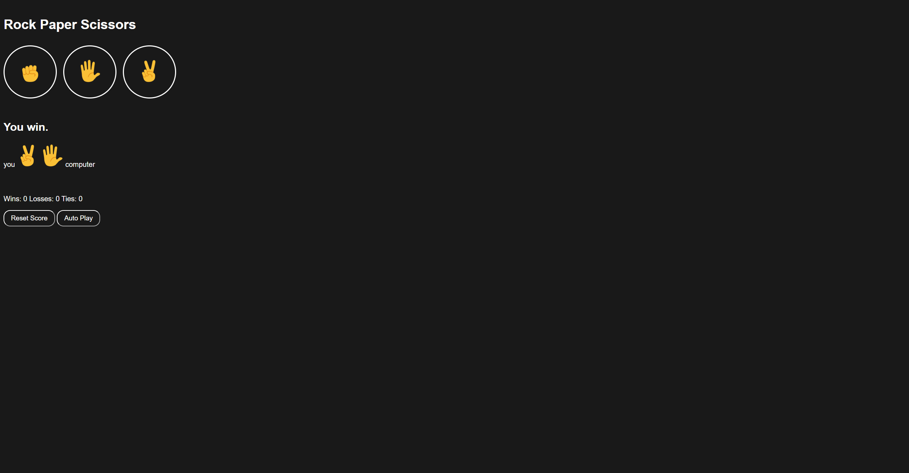

# Rock Paper Scissors

This is a simple Rock Paper Scissors game implemented in JavaScript. It allows you to play the game against the computer and keeps track of your wins, losses, and ties. Additionally, there is an auto-play mode that plays the game automatically at a regular interval.

## Features

- Play Rock Paper Scissors against the computer
- Keep track of wins, losses, and ties
- Auto-play mode to play the game automatically
- Reset the score

## How to Play

1. Open the `index.html` file in a web browser.
2. Click on the buttons labeled with rock, paper, or scissors to make your move.
3. The game will display the result (win, loss, or tie) and update the score accordingly.
4. You can also use the keyboard keys `r`, `p`, and `s` to play with rock, paper, or scissors, respectively.
5. To activate auto-play mode, click on the "Auto Play" button. The game will play automatically at a regular interval until you stop it.
6. To reset the score, click on the "Reset Score" button.

## Preview

## Dependencies

No external dependencies are required to run this app.

## Compatibility

This app is compatible with modern web browsers.

## License

This project is licensed under the [MIT License](LICENSE).
